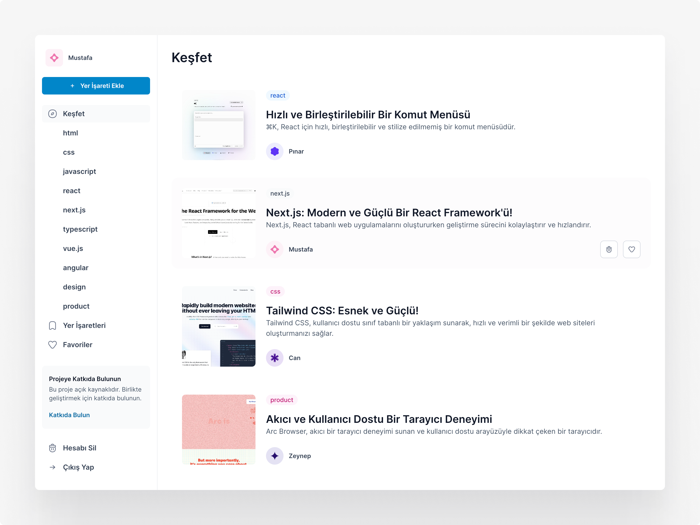

# Bookmarks

Bookmarks, yer işaretlerinizi paylaşmanızı kolaylaştırırken aynı zamanda yeni içerikleri keşfetmenize olanak tanıyan bir projedir.



## Özellikler

- Firebase Authentication ile kullanıcılar e-posta ve şifre kullanarak uygulamaya kaydolabilir ve giriş yapabilirler.

- Firebase Realtime Database kullanarak, kullanıcılar yer işaretlerini tüm kullanıcıların görüntüleyebileceği şekilde paylaşabilir.

- Kullanıcılar kendi paylaştıkları yer işaretlerini silebilirler.

- Kullanıcılar, kendi paylaştıkları veya diğer kullanıcıların paylaştığı yer işaretlerini favorilere ekleyebilirler.

- Kullanıcılar, belirli bir etiketle işaretlenmiş yer işaretlerini görüntüleyebilirler.

## Kullanılan Teknolojiler

- **Vite:** Proje geliştirme sürecinde Vite kullanılmıştır.

- **React:** Kullanıcı arayüzünü oluşturmak için React kütüphanesi kullanılmıştır.

- **Firebase:** Kullanıcı kimlik doğrulama, veritabanı yönetimi ve depolama gibi işlevleri sağlamak için Firebase platformu kullanılmıştır.

- **Framer Motion:** Kullanıcı arayüzü animasyonları için Framer Motion kütüphanesi kullanılmıştır.

- **Tailwind CSS:** Kullanıcı arayüzünün tasarımını oluşturmak için Tailwind CSS kullanılmıştır.

## Yapılacaklar

- Sayfaların meta verileri ile bağlantıların önizlemelerini oluşturma özelliğini ekleyin.

- Kullanıcıların tercihlerine uygun bir deneyim sunmak için koyu tema desteği ekleyin.

## Firebase Yapılandırması

1. [Firebase Console](https://console.firebase.google.com/)'a gidin.

2. Var olan bir Firebase projesi seçin veya yeni bir proje oluşturun.

3. Firebase Authentication bölümüne gidin ve "E-posta / Şifre" kimlik doğrulama yöntemini etkinleştirin. Bu, kullanıcıların e-posta ve şifre kullanarak kaydolmalarını ve giriş yapmalarını sağlayacaktır.

4. Firebase Realtime Database bölümüne gidin ve veritabanı oluşturma işlemi için gerekli adımları takip edin.

5. Veritabanı oluşturulduktan sonra, aşağıdaki veritabanı modelini ve kurallarını kullanarak devam edebilirsiniz. Bu kurallar, kullanıcıların yalnızca kendi yer işaretlerini silebilmelerini sağlar. Böylece kullanıcılar, diğer kullanıcıların yer işaretlerine müdahale edemezler.

   ```json
   {
     "bookmarks": {
       "bookmark1": {
         "description": "React projeniz için mükemmel yer tutucu avatarlar.",
         "id": "bookmark1",
         "likes": {
           "user1": true
         },
         "tag": "react",
         "timestamp": 1685174317995,
         "title": "Avvvatars React",
         "url": "https://avvvatars.com/",
         "userDisplayName": "Mustafa",
         "userId": "user1",
         "private": false
       }
     },
     "users": {
       "user1": {
         "bookmarks": {
           "bookmark1": {
             "description": "React projeniz için mükemmel yer tutucu avatarlar.",
             "id": "bookmark1",
             "likes": {
               "user1": true
             },
             "tag": "react",
             "timestamp": 1685174317995,
             "title": "Avvvatars React",
             "url": "https://avvvatars.com/",
             "userDisplayName": "Mustafa",
             "userId": "user1"
           }
         },
         "favorites": {
           "bookmark1": {
             "description": "React projeniz için mükemmel yer tutucu avatarlar.",
             "id": "bookmark1",
             "likes": {
               "user1": true
             },
             "tag": "react",
             "timestamp": 1685174317995,
             "title": "Avvvatars React",
             "url": "https://avvvatars.com/",
             "userDisplayName": "Mustafa",
             "userId": "user1"
           }
         }
       }
     }
   }
   ```

   ```json
   {
     "rules": {
       "bookmarks": {
         ".read": true,
         ".indexOn": ["tag"],
         "$bookmarkId": {
           ".write": "auth != null && (newData.child('userId').val() === auth.uid || data.child('userId').val() === auth.uid)",
           "likes": {
             "$userId": {
               ".write": "auth.uid == $userId"
             }
           }
         }
       },
       "users": {
         "$userId": {
           ".read": "auth != null && auth.uid == $userId",
           ".write": "auth != null && auth.uid == $userId"
         }
       }
     }
   }
   ```

6. Firebase artık hazır. Proje ayarlarından Firebase proje yapılandırma bilgilerinizi alabilirsiniz. Bunlar, .env dosyasında Firebase yapılandırma değerlerini doldurmak için kullanılacak olan API anahtarı, proje kimliği vb. bilgilerdir.

## Bilgisayarınızda Çalıştırın

Projeyi klonlayın.

```bash
git clone https://github.com/pekkiriscim/bookmarks.git
```

Proje dizinine gidin.

```bash
cd bookmarks
```

Gerekli paketleri yükleyin.

```bash
npm install
```

Firebase projenize ait yapılandırmaları .env dosyasına ekleyin ve sunucuyu çalıştırın.

```bash
npm run dev
```

Projeyi derleyin.

```bash
npm run build
```

Önizlemeyi başlatın.

```bash
npm run preview
```

## Teşekkürler

- [@nusu:](https://github.com/nusu) Benzersiz ve eğlenceli avatarlar için.

- [@emilkowalski:](https://github.com/emilkowalski) Harika animasyonlu bildirimler için.

## Lisans

Bu proje MIT Lisansı altında lisanslanmıştır.

## Katkı

Katkılarınız projeyi daha da renklendirebilir. Deneyimlerinizi ve fikirlerinizi paylaşarak projenin gelişimine katkıda bulunun.
